# BookHaven — Library Management System

BookHaven is a modern, responsive library management web app built with React, TypeScript, Tailwind CSS, and Vite. It lets members browse and search a catalog of books, check out and reserve titles, maintain a wishlist, leave reviews, and lets admins manage the book collection, checkouts, and members.

## Table of Contents

- [Features](#features)
- [Tech Stack](#tech-stack)
- [Entity Relationship Diagram](#entity-relationship-diagram)
- [Screenshots](#screenshots)
- [Getting Started](#getting-started)
- [Accounts & Roles](#accounts--roles)
- [Data & Persistence](#data--persistence)
- [Project Structure](#project-structure)
- [Known Limitations](#known-limitations)
- [Future Improvements](#future-improvements)
- [License](#license)

## Features

### For Members

- Browse a catalog of 100 books across 20+ genres
- Search by title/author and filter by genre, availability, and sort order
- View detailed book information, ratings, and reviews
- Checkout available books and reserve unavailable ones
- Maintain a personal wishlist
- Track borrowed books, due dates, and reading history from a personal dashboard
- Leave star ratings and written reviews

### For Admins

- Add, edit, and delete books from the catalog
- View and manage all active/overdue/returned checkouts
- View a list of all registered members
- View library-wide analytics: genre distribution, most checked-out books, top-rated books, and recent activity

### General

- Light/dark theme toggle
- Fully responsive layout (mobile, tablet, desktop)
- Data persists across page refreshes via the browser's `localStorage`

## Tech Stack

- **React 18** + **TypeScript**
- **Vite** for development and builds
- **Tailwind CSS** for styling
- **Lucide React** for icons
- **Supabase** (Postgres database + Authentication)

## Entity Relationship Diagram

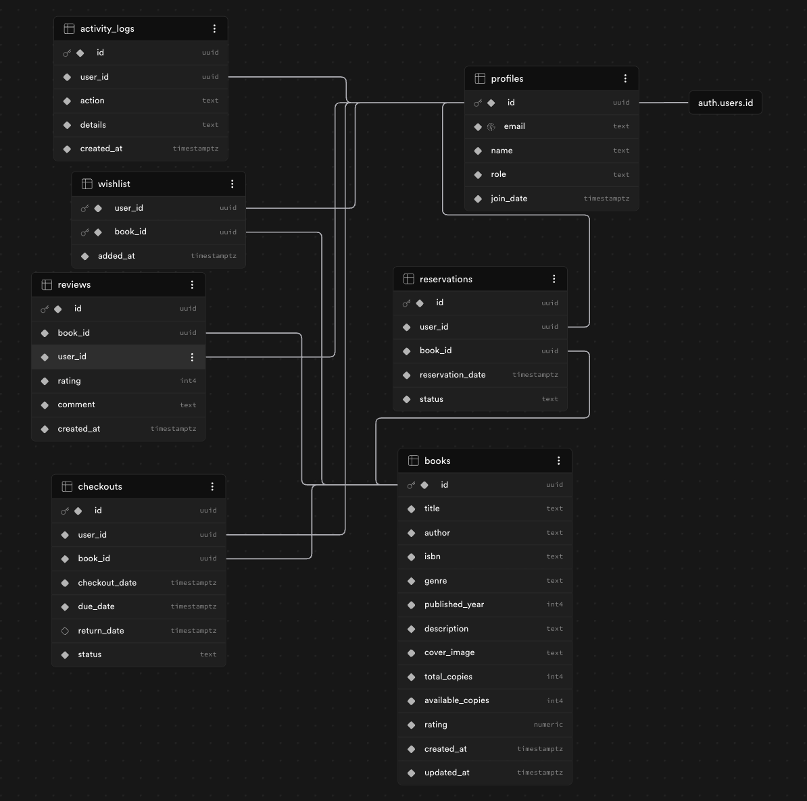

## Screenshots

- 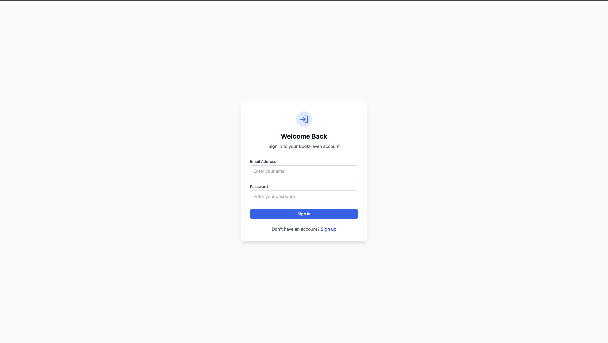
- 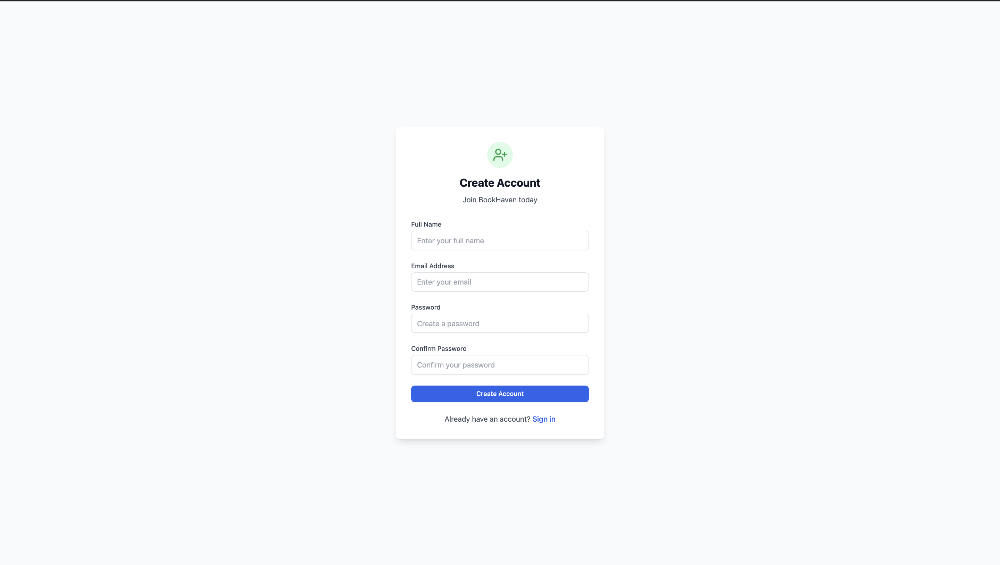
- 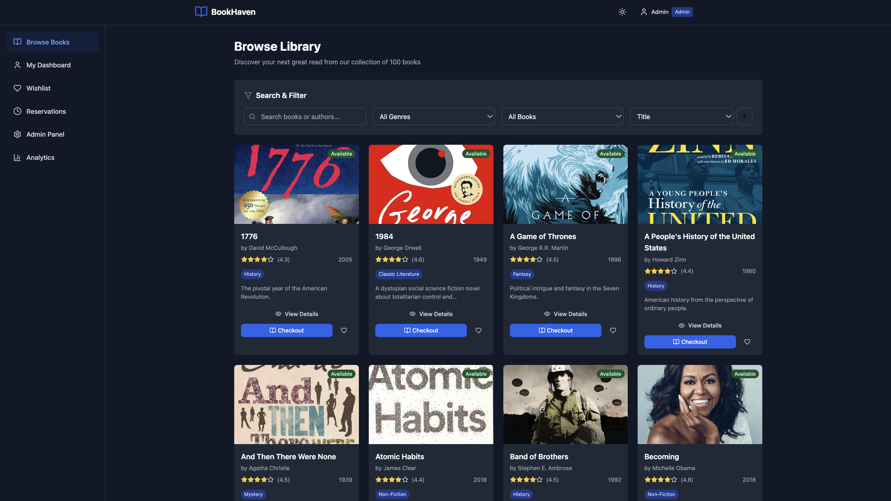
- 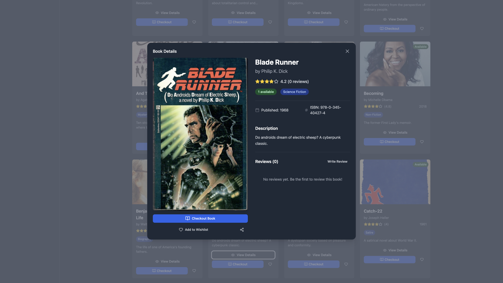
- 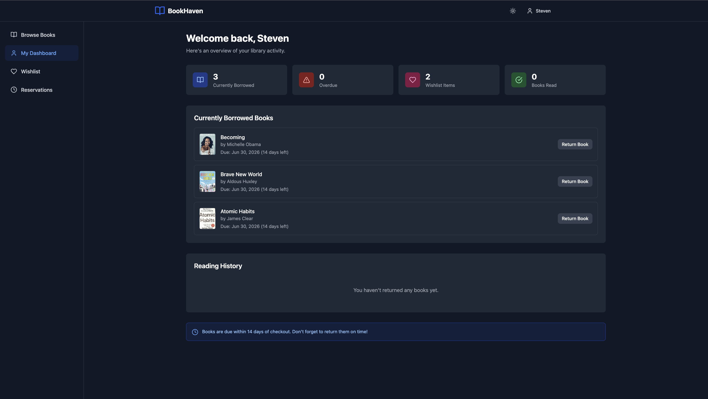
- 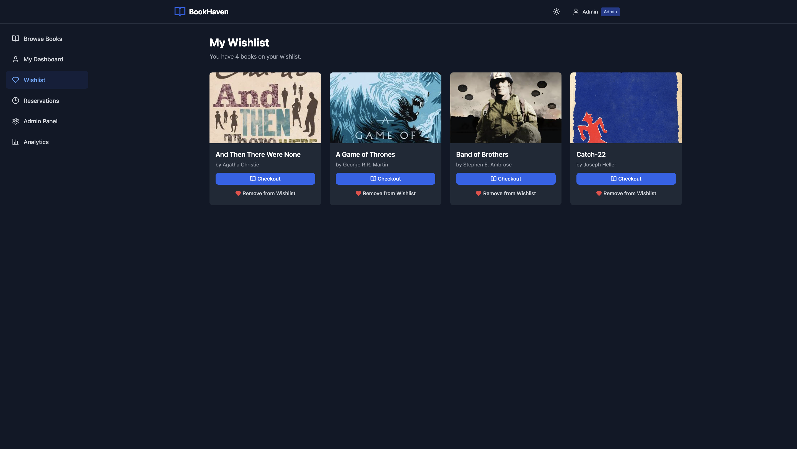
- 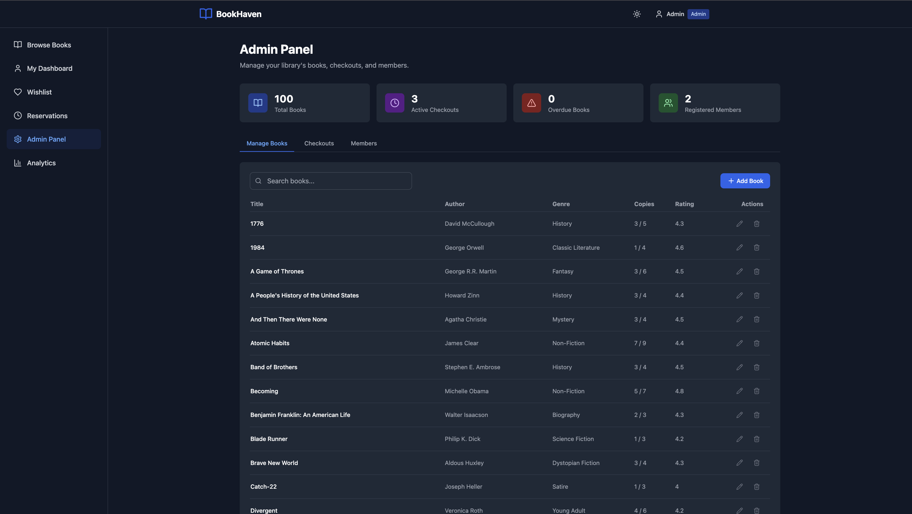
- 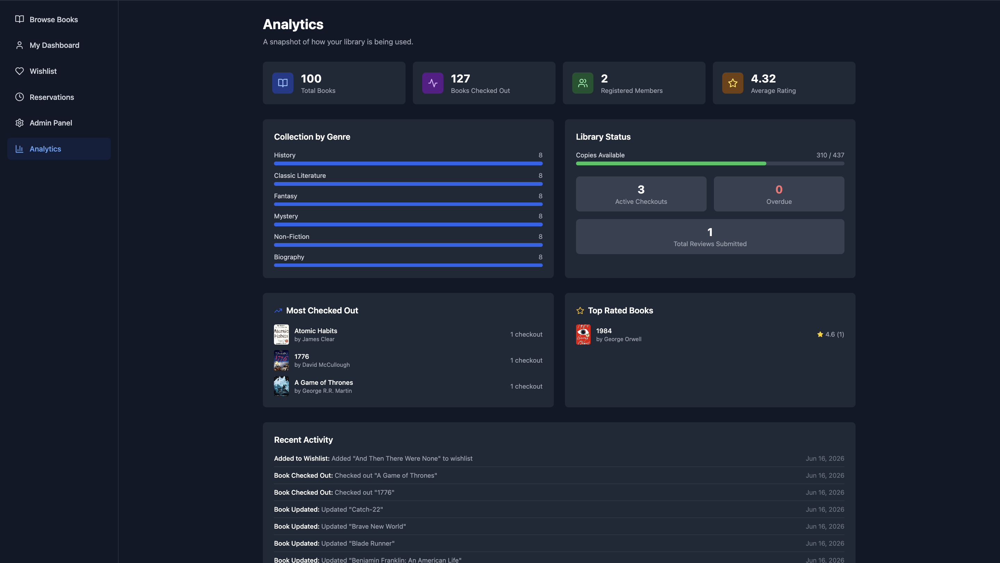
- 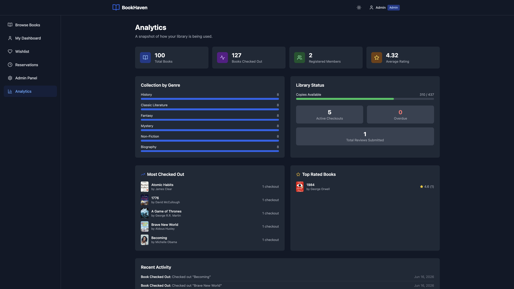
- 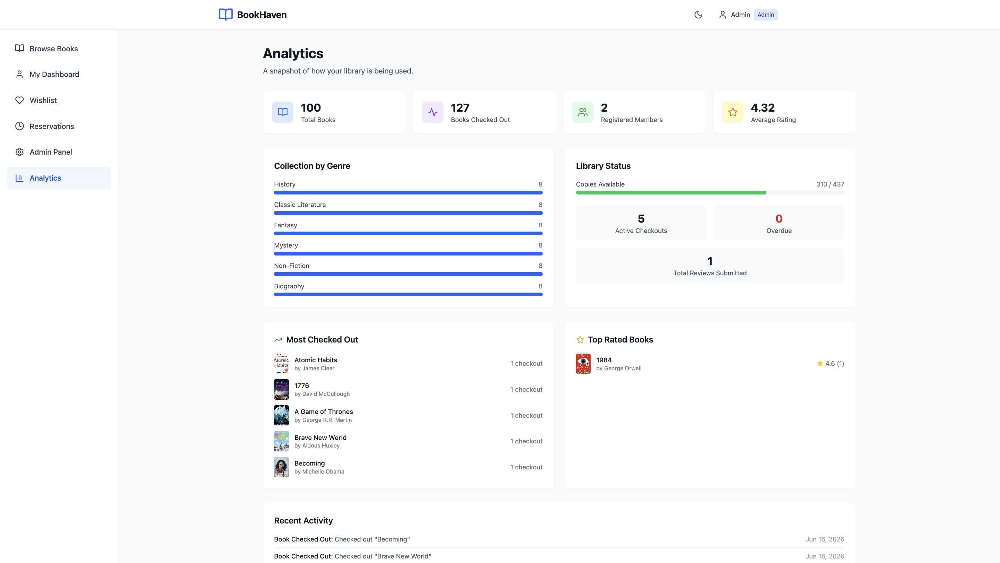

| Library Browse                               | Book Details                                           |
| -------------------------------------------- | ------------------------------------------------------ |
|  |  |

| User Dashboard                                   | Admin Panel                                          |
| ------------------------------------------------ | ---------------------------------------------------- |
|  |  |

### Prerequisites

- [Node.js](https://nodejs.org/) version 18 or later
- npm (comes with Node.js)
- A [Supabase](https://supabase.com) account and project

### 1. Set up Supabase

1. Create a project at [supabase.com](https://supabase.com).
2. In the SQL Editor, run the schema setup script (creates `profiles`, `books`, `checkouts`, `reservations`, `reviews`, `wishlist`, `activity_logs` tables, plus Row Level Security policies).
3. Run the `seed_books.sql` script to populate the `books` table with the starting catalog.
4. Go to **Settings → API** and copy your **Project URL** and **anon/publishable key**.

### 2. Configure environment variables

```bash
cp .env.example .env
```

Edit `.env` and fill in your Supabase values:

```
VITE_SUPABASE_URL=https://your-project-id.supabase.co
VITE_SUPABASE_ANON_KEY=your-anon-or-publishable-key
```

`.env` is gitignored and should never be committed.

### 3. Install and run

```bash
# Clone the repository
git clone <your-repo-url>
cd Library_Management_System

# Install dependencies
npm install

# Start the development server
npm run dev
```

The app will be available at `http://localhost:5173`.

### Other Commands

```bash
npm run build    # Build for production
npm run preview  # Preview the production build locally
npm run lint     # Run ESLint
```

## Demo Accounts

The app comes with two seeded accounts for testing:

| Role  | Email               | Password |
| ----- | ------------------- | -------- |
| Admin | admin@bookhaven.com | admin123 |
| User  | john@example.com    | user123  |

A "Quick Admin Login" button on the sign-in screen fills in the admin credentials automatically. You can also register a new account from the sign-up form.

## Accounts & Roles

There are no pre-seeded login accounts - register a new account from the sign-up form. All new accounts default to the `user` role.

To make an account an **admin**:

1. Register normally through the app.
2. In your Supabase project, go to **Table Editor → profiles**, find your row (matched by email), and change the `role` column from `user` to `admin`.
3. Log out and back in (or refresh) to see the Admin Panel and Analytics tabs in the navigation.

This also means anyone who clones this repository and connects their own Supabase project can promote any account to admin the same way — just edit the `role` value in the `profiles` table for that user. There's no separate admin sign-up flow; role changes are managed directly in the database.

## Data & Persistence

All data (books, user profiles, checkouts, reservations, wishlists, reviews, and activity logs) is stored in a Supabase Postgres database and accessed via the Supabase JS client. Authentication is handled by Supabase Auth.

This means:

- Data is shared across all users and devices — there's a single source of truth in the cloud.
- Row Level Security (RLS) policies control access: anyone can browse the book catalog, but only admins can add/edit/delete books, and users can only see and manage their own checkouts, reservations, and wishlist.
- Adding a book as an admin, or registering a new account, is immediately reflected in the Supabase project (visible in the Table Editor).

## Project Structure

```
src/
├── components/
│   ├── admin/        # Admin panel, analytics, and book form
│   ├── auth/         # Login and registration forms
│   ├── dashboard/     # User dashboard, wishlist, reservations
│   ├── layout/        # Header, footer, navigation, layout shell
│   ├── library/       # Book grid, book cards, book details, filters
│   └── ui/            # Reusable UI primitives (Button, Input, Modal)
├── contexts/          # Auth and Library React contexts (Supabase-backed)
├── lib/               # Supabase client and database row types
├── types/             # Shared TypeScript types
└── utils/             # Constants and checkout helpers
```

## License

This project was built for educational purposes as part of a final assignment.
